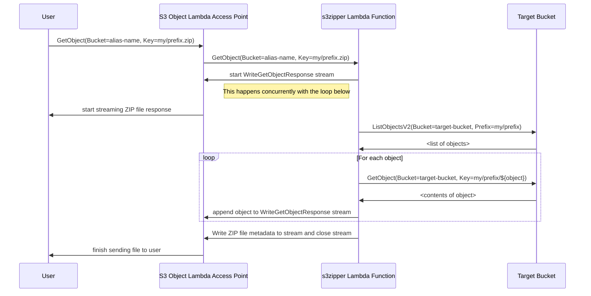

# s3zipper

`s3zipper` is a couple of Lambda functions that let you use [S3 Object Lambda Access Points][olap]
to download ZIP files of directories[1] in S3 on-demand. Once deployed, you don't
need any special tools installed on your client - anything that can download from
S3 will do.

## Usage:

First, deploy the template:

```
sam build && sam deploy \
  --stack-name myolap \
  --resolve-s3 \
  --capabilities CAPABILITY_IAM \
  --parameter-overrides \
      ParameterKey=BucketName,ParameterValue=my-target-s3-bucket \
      ParameterKey=RealContentLength,ParameterValue=false
```

Second, you'll need to get the alias of the access point. It would be nice if
this was emitted by the stack deployment, but I think there's a bug in the
CloudFormation resource definition. So you have to run this command:

```
aws s3control get-access-point-for-object-lambda \
  --account-id $(aws sts get-caller-identity --output text --query Account) \
  --name myolap \
  --output text \
  --query Alias.Value
```

That will return a name like `myolap-somerandomstring--ol-s3`. You can think of
that as the name of the "proxy bucket" that will invoke s3zipper.

Finally, download a ZIP! If you have a bunch of objects at 
`s3://my-target-s3-bucket/prefix/to/files/...`, then you can download a ZIP 
like this:

```
aws s3 cp s3://myolap-somerandomstring--ol-s3/prefix/to/files.zip .
```

[1]: They're technically _prefixes_, S3 doesn't have directories in a 
file-system sense. But it's close enough.

## Random notes and caveats

### Incorrect file size reported by AWS CLI during download

You will see progress that looks like this:

```
Completed 539.2 MiB/1.0 KiB (29.3 MiB/s) with 1 file(s) remaining
```

This can be fixed by setting the `RealContentLength` stack parameter to `true`.
The issue is that for files over 5MB, the AWS CLI will download the file in
multiple chunks in parallel for improved performance - but s3zipper doesn't
support the `Range` requests functionality for that. We work around that limitation
by lying about the file size in the `Content-Length` header. If you enable the 
real Content-Length, you should force the CLI to use only one chunk with this:

```
aws configure set default.s3.multipart_threshold 5TB
```

### CloudTrail reports activity from s3zipper, not the end-user

S3 Object Lambda access points do provide functionality to ensure that the
end-user is correctly attributed in CloudTrail, but it doesn't work for our
use-case as we need to initiate _many_ `s3:GetObject` calls (for each file in 
the ZIP) in response to the user's original API call.

### Huge files will fail

S3 OLAP enforces a 60 second timeout on the Lambda function. That means that 
the largest file that can be returned is determined by how much data can be
sent in that time window. The bandwidth depends on the number of objects in the
ZIP and how large they are. In my limited testing, I've seen rates between
10 MB/s and 60 MB/s, which translates to a maximum ZIP size of 600MB - 3.6 GB.

### How does it work?

Here's a sequence diagram that explains how it works. The key thing to note is
that everything is streamed, so the user starts to receive the ZIP file as soon
as the first object is retrieved from S3. Streaming also means that memory usage
in the Lambda function never grows above 40 MB even for a ZIP file that is multiple
gigabytes.



[olap]: https://docs.aws.amazon.com/AmazonS3/latest/userguide/transforming-objects.html
